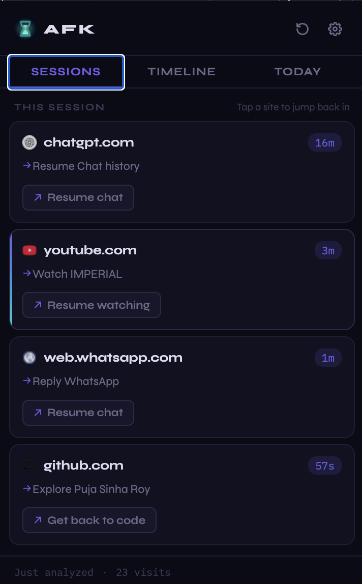
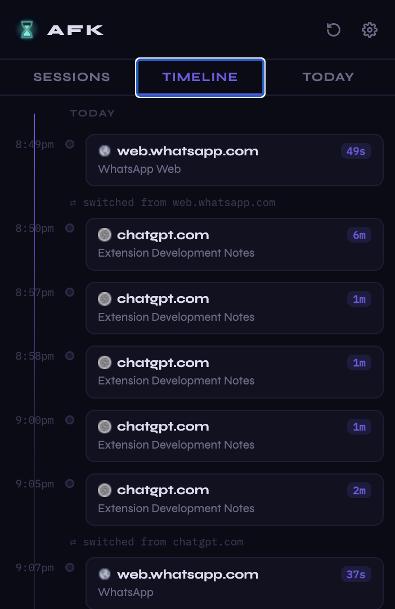
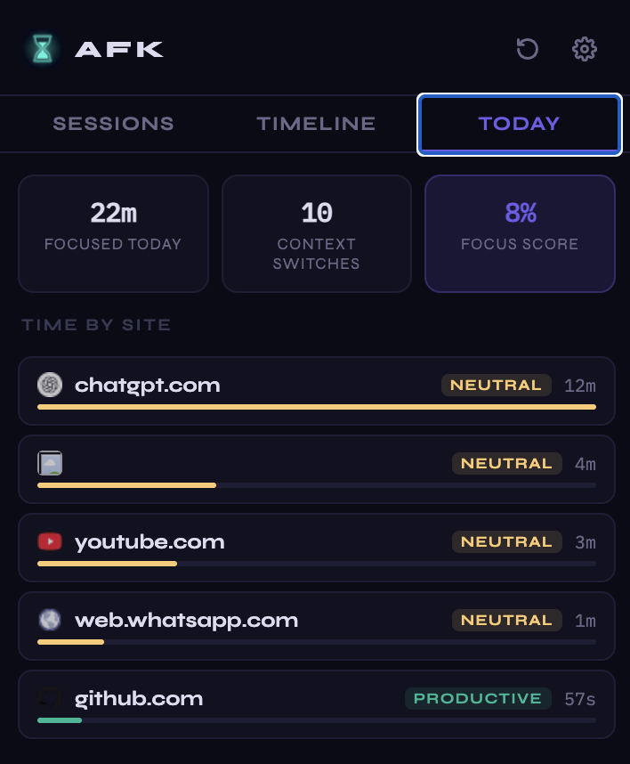
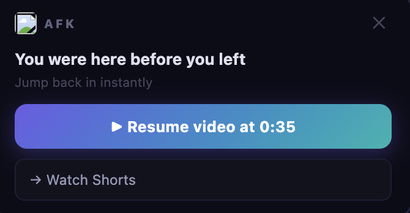

# 🚀 AFK — Resume Instantly

> Pick up exactly where your brain left off.

AFK is a Chrome extension that helps you **instantly resume your work after interruptions** by reconstructing context from your browsing session.

---

## 🧠 The Problem

Every time we switch tabs or step away, we lose context.

When we return, we waste time figuring out:

* What was I doing?
* Where did I leave off?
* What should I do next?

---

## 💡 The Solution

AFK automatically tracks your activity and, when you return, helps you:

* Resume exactly where you left
* Understand what you were doing
* Take the next meaningful action

---

## ✨ Features

### 🔁 Instant Resume

* Restores scroll position and video timestamps
* Jump back to your exact spot instantly

### 🧠 Context-Aware Actions

* Resume chat history
* Continue watching videos
* Reply to messages
* Get back to coding

### 📊 Focus Insights

* Tracks time spent across sites
* Calculates a weighted **focus score**
* Shows context switches and activity timeline

### 🧩 Cross-Site Support

Works across multiple platforms:

* Chat apps (WhatsApp, ChatGPT)
* Video platforms (YouTube)
* Developer tools (GitHub)
* Documents and more

---

## 🏗️ Architecture

* **Background Service Worker**

  * Session tracking
  * Idle detection
  * Activity lifecycle management

* **Content Script**

  * DOM extraction
  * Overlay injection
  * Scroll & video state tracking

* **Popup UI**

  * Sessions view
  * Timeline visualization
  * Focus analytics

---

## 🎯 Example Flow

1. Scroll through an article or watch a video
2. Switch tabs or go AFK
3. Return after some time
4. AFK shows:

   * “Resume exactly where you left”
   * Relevant next actions
5. Click → instantly back in context

---

## ⚙️ Tech Stack

* JavaScript (ES6+)
* Chrome Extensions API (Manifest V3)
* DOM APIs
* Local storage
* (Optional) LLM integration for smart actions

---

## 🚧 Future Improvements

* 🧠 Semantic context understanding (intent-based classification)
* 🤖 Smarter action generation using AI
* 🔄 Cross-device session sync
* 📉 Advanced focus analytics

---

## 📸 Screenshots

### 🧠 Sessions View

### ⏱️ Timeline View

### 📊 Focus Analytics

### 🔁 Resume Overlay

---

## 🚀 Installation

1. Clone this repository
2. Go to `chrome://extensions`
3. Enable Developer Mode
4. Click **Load unpacked**
5. Select the project folder

---

## 🤝 Contributing

Open to ideas, feedback, and improvements!

---

## 📬 Contact

Feel free to reach out or connect on LinkedIn.
